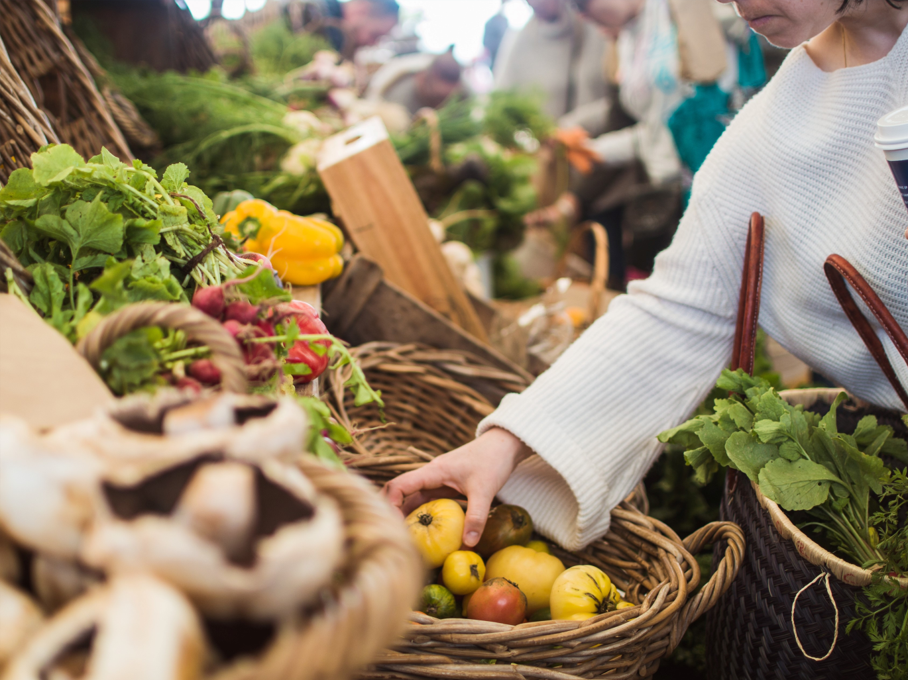

Great news! The DRBI Agricultural Project is up and running with its first 3,000 sq ft plot leased to
project manager Dwight Cox’s friend of nearly 40 years, Gene Kraay. By mid-February, the two friends –
with help from their wives and Kraay’s youngest son, daughter-in-law and two grandsons – enclosed a
full acre with fence to deter rodents from entering the plot. With that job finished, they tilled and
plowed the plot, making it ready to accept plants. Now nearly 1,000 seeds and plants in the hoop house
are sprouting and soon will be transferred to the field. The incentive to move forward without delay on
this initial plot came from Kraay’s friend Justin, a boxer in Cité Soleil, Haiti.

The Lost Children of Haiti: Kraay, who boxed in college and was an All-American soccer player, brought
U.S. soccer great Tony Sanneh to give soccer clinics to Haitian children in the Cité Soleil ghetto outside
Haiti’s capital Port-au-Prince. The International Red Cross calls this ghetto “a microcosm of all the ills in
Haitian society: endemic unemployment, illiteracy, non-existent public services, unsanitary conditions,
rampant crime and armed violence.”\

Kraay organized and led four more clinics to Haiti that year for the children to keep them occupied and
limit their exposure to the gangs that rule the streets. On his final trip, Kraay met a young boxer named
Justin who was training on the periphery of the gravel park he used for the clinics. Despite each man’s
lack of proficiency in the other’s language, they connected and forged a strong friendship.

When Justin expressed his desire to organize a boxing club for the ghetto children, Kraay was ready to
help. Together and with a small circle of friends – including Dwight Cox and his wife Letty – he worked
with Justin to create the Guepard Boxing Club of Cité Soleil [GBCCS].

The program was simple. Justin rented space in the ghetto to train up
to 300 young people as well as additional space for a kitchen and dining
hall to feed the children after every training session. GBCCS trains and
operates four days each week, and the simple meal they provide the
children is often the only meal these children receive that day. While
Justin managed the operation in Haiti, Kraay raised what money he
could to support the effort.

An Idea Germinates: In October 2020, Justin posted a picture on
Facebook and asked, “…are they the ones who make the choice to live
like this?… children don’t deserve [this] treatment.”

Kraay shared the picture with his friend Dwight, and they pondered it
for many days. Then one morning, last October, while contemplating
their next move with the DRBI Agricultural project they simultaneously
said: “WHAT IF we could grow food through the Agricultural Project,
sell it in local farmer’s markets, and distribute ALL gross revenues
DIRECTLY to Justin and GBCCS?”

“WHAT IF we could expand the idea and develop other plots to directly support other marginalized
people around the world in places like the Philippines, Syria, Somalia, Ecuador…” the list was limitless,
and the idea expanded like yeast.

It was at that moment that Kraay decided to lease the initial 3,000 sq.ft. plot and with Dwight’s help to
grow vegetables to support the children in Haiti. They discussed the
idea with management at Desert Rose Farm and Black Orchard
Trading Company and both organizations are eager to help so that
Cox and Kraay can focus on the Agricultural Project and not have to
divert their attention to the marketing aspects of moving produce.
To put the Haiti Project into a more measurable perspective… in
October, Justin explained that he can feed 180 children, four days
each week for just over $1,000 a month. It is important to note that
all of the food is grown and purchased in Haiti. The operation in Haiti
is managed and operated by Haitians on an extremely small stipend. Most Haitians who work the
program in-country – most notably the boxers like Justin who train the children – are volunteers. ALL of
the money from the Haiti Project will go DIRECTLY to Haiti and supports Haitians.
The Value of an Eggplant: DRBI long-time volunteer Bonnie Tozer has taken an active part with the
Haitian project and recently, as she prepared to drive to Casa Grande on an errand, she asked Kraay if
there was anything he needed. Recognizing that the Haitian Project needed more seeds to plant, he
asked her to secure more seeds, specifically eggplant seeds.

True to form, Bonnie had the seeds in the hoop house so Kraay could plant them the next morning. He
found a note with the seeds, “Happy Ayyam-i-Ha! Please accept this donation for this noble project.”
Moved by her generosity, Kraay responded, “To make some sense of how significant your act of
kindness is… As of this morning, I’ve planted 200 seeds… Although it is unlikely and would qualify as
miraculous, if all 200 seeds produce 200 plants, and if each plant produced 12 eggplants, just those 200
seeds can produce – in a perfect climate – 2,400 eggplants. I plan to ‘wholesale’ the vegetables from
our Haiti plot at $2/eggplant. Assuming they retail at $4/eggplant – those 200 planted seeds have the
potential to yield $4,800. My friend Justin feeds 180 children, four meals each week at $1,000/month…
that’s over 3,000 meals each month. Your eggplant seeds have the potential to feed 180 children for
nearly five months! Unfortunately, the world and the climate are not perfect and the children, Justin,
Dwight and I will be thankful and grateful for however many eggplants we can harvest.”
It is amazing how a few packets of seed can potentially feed so many hungry children for nearly half a
year!

Moving Forward: With support from committed people like Bonnie Tozer, Halen Jimenez from
Southwest Airmotive, James Wilson, Chico Benitez who works the Desert Rose Farm acres and other
family and friends, Cox and Kraay are poised to prove this unique concept to feed marginalized children
around the world starting in Haiti. Although the Haitian Project is international in scope and Cox and
Kraay hope to duplicate it in other international venues, working with DRBI, they hope to serve other
organizations in the local community and surrounding areas as well.

The upcoming months will be critical as the two transfer the seedlings from the hoop house to the tilled
ground. The challenges are significant, but Cox and Kraay have been together for nearly 40 years and
have never walked away from adversity. The payoff on the Haiti Project affects so many lives, their
commitment is cast in concrete.

