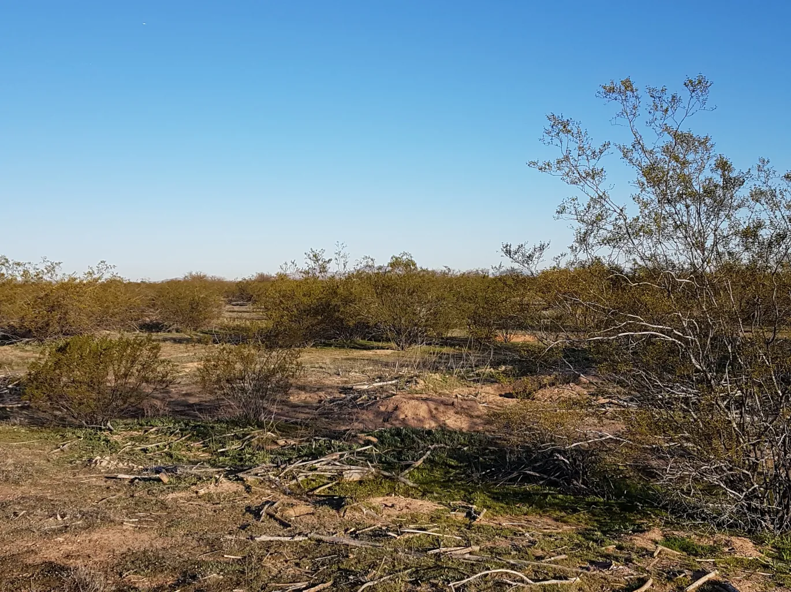
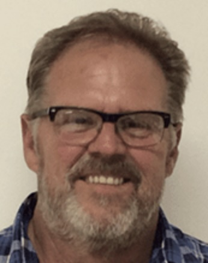
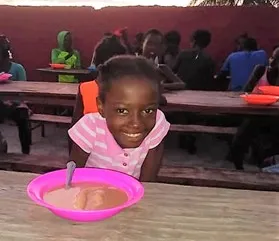

## Sustainable, Organic Farming at Desert Rose: Greening the Sonora

[How Desert Rose is creating market gardens in the Arizona desert ->](/agriculture/greening-sonora)

 

 

----

## Meet the DRBI Farmer:

 

When Dwight Cox was a teenager all he could think of was escaping from his family’s small Illinois farm.  The last thing he expected was to be running an even smaller farm in the Arizona desert!

Now passionate about DRBI Agriculture, Dwight Cox had no interest in his family’s Indiana farm when he was young. He preferred machines to crops, so he left the farm and joined the army.

His military service changed the path of his life in two ways. First, he became a Bahá’í in 1975 – a wonderful consequence of being stationed in a MASH unit in Hawaii. Second, when he left the military, thanks to his GI Bill benefits, Dwight attended college for aviation mechanics, and then received his pilot’s licence.  This was the start of a long, successful career in aviation. As a tech rep for Rockwell International, he worked in the Philippines, Japan, Singapore, Mexico and Florida, eventually starting his own aviation engine company, Southwest Airmotive in Tucson in 2004.

Yet Dwight had never forgotten his farming roots. As part of his deep belief in service to humanity, Dwight had participated in several endeavours that improved food distribution both at home and abroad.  When he moved his business to the nearby Eloy Airport in 2015, Dwight found DRBI not far away and became a Board Member.  He soon recognized an opportunity to turn a segment of Desert Rose into an organic, sustainable farm.

Dwight quickly established that the ground was incapable of supporting life. He evaluated various approaches for bringing microbial life back to the soil and became excited by the possibilities of permaculture. Permaculture is the development of agricultural ecosystems intended to be sustainable and self-sufficient.  After taking an extensive 28-week course from global expert Geoff Lawton, Dwight is now certified as a Permaculture Designer.

Dwight brought in Desert Rose Farms LLC  to grow Pichuberries (Tomatitos) on 10 acres of the land.  Desert Rose Farms  will also be assisting with establishment of market gardens, one of Dwight’s earliest dreams for the property.  Dwight’s intent is to teach some of the central ideas and techniques of permaculture, such as composting and water preservation, in order to create a self-sustaining ecosystem based on soil health.

To do this, DRBI has work to do.  A new well is needed to support the farm and an old well at the Institute has gone bad.  Drilling wells is expensive, so further developments are in limbo until adequate funds can be raised.

Dwight worked 43 years in aviation, far from that little farm of his youth, but now he has circled back, and he is loving it.  When asked, “what would you tell that impatient boy back in Indiana?”  Dwight replied, “Just wait! You aren’t going to believe your life!”

*****

## THE HAITI PROJECT

Haiti Project May 2021Great news!  Revenue from 3,000 sq ft of DRBI’s land is dedicated to feeding children in Haiti.

“WHAT IF we could grow food through the Agricultural Project, sell it in local farmer’s markets, and distribute ALL gross revenues DIRECTLY to Justin and the GBCCS?”

[That's the idea behind the Haiti Project -->](/agriculture/haiti-project)

----

## Permaculture: Greening the Desert by Geoff Lawton

<iframe style="position:absolute;top:0;left:0;width:100%;height:100%;"  src="https://www.youtube.com/embed/2xcZS7arcgk?si=glWhZtOOv2x7zm49" title="YouTube video player" frameborder="0" allow="accelerometer; autoplay; clipboard-write; encrypted-media; gyroscope; picture-in-picture; web-share" referrerpolicy="strict-origin-when-cross-origin" allowfullscreen></iframe>

----

### Barry Lewis Green with Kelly Hadden and Dwight Cox on agriculture

<iframe src="https://player.vimeo.com/video/809823609?h=cb2bf5077a" style="position:absolute;top:0;left:0;width:100%;height:100%;" frameborder="0" allow="autoplay; fullscreen; picture-in-picture" allowfullscreen></iframe>

<a href="https://vimeo.com/809823609">TUGtalks DRBI and Agriculture</a> from <a href="https://vimeo.com/user100352308">Barry Lewis Green</a> on <a href="https://vimeo.com">Vimeo</a>.

Barry Lewis Green, TUG, The Unity Guy holds cool conversation with Kelly Hadden and Dwight Cox of the Desert Rose Baha&#039;i Institute... focusing thought on the important work DRBI is doing around agriculture, community and Service.

----

