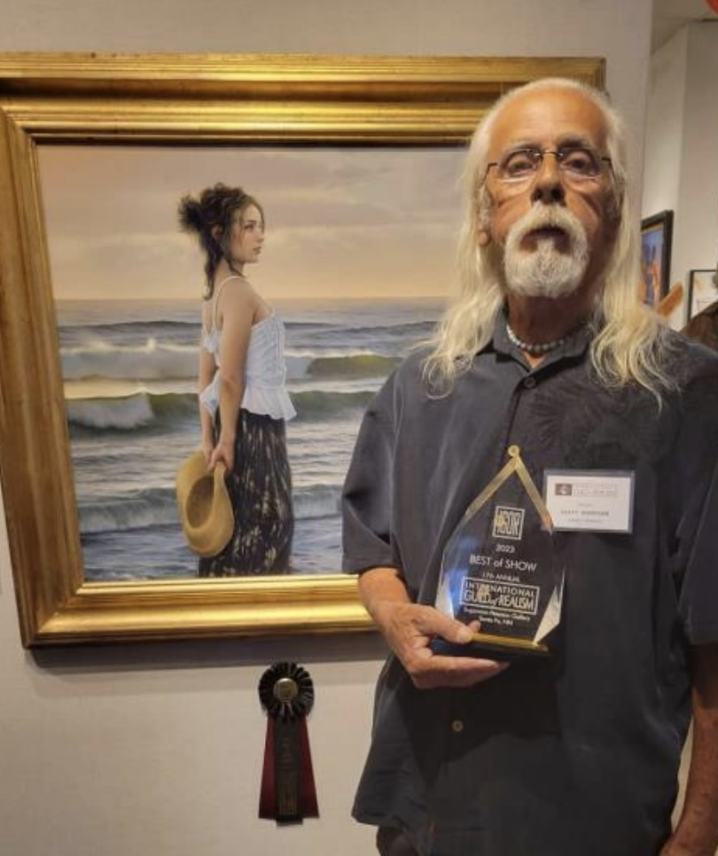

## DUFFY SHERIDAN AWARDED COVETED HONOR

Friends of DRBI will not be surprised to learn that Duffy Sheridan, who has been a member of the DRBI
community since it’s inception, continues to earn international accolades for his extraordinary artwork.
It wasn’t long ago that we celebrated the selection of one of Duffy’s images to be included in the Lunar
Codex, "Nova Collection". 3,000 artworks were laser-etched on a nickel microfiche, enclosed in a time
capsule on a lunar lander, and placed on the Moon in November 2022, where they will remain in
perpetuity.

In June 2023 we learned that Duffy’s painting “What Will Tomorrow Bring” received the Best of Show
and Director’s Choice Awards at the International Guild of Realism (IGOR) 17th annual juried exhibition.

Over 400 exceptional artworks were entered, and the final selection representing 98 pieces from 94
IGOR artist members. Founded in 2004 by a group of renowned artists, IGOR (realismguild.com) now
represents the work of more than 450 members from over 35 countries and prides itself in and
honoring the finest examples of realism in the world.

Our congratulations to Duffy for this latest achievement!

To learn more about Duffy please visit his website at: [duffysheridan.com](https://duffysheridan.com)

Instagram: #theofficialduffysheridan

