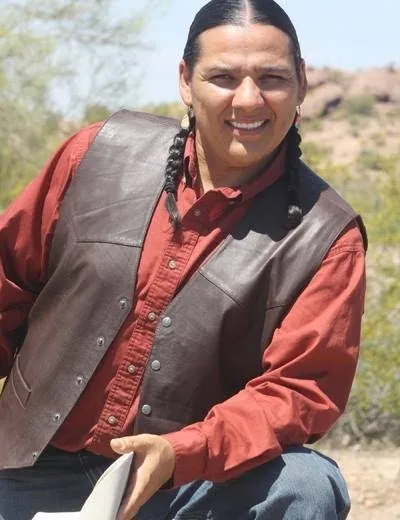

## Roman Orona: iamHUMAN

### “Creating art to challenge, unify and elevate humanity”

Born in New Mexico in the heart of Chiricahua country Roman proudly carries Apache, Pueblo and Yaqui blood.  That background, combined with being raised in a Bahá’í household, meant that Roman has always been inspired to unite humanity.

But how do you turn your beliefs into your life’s work?  The functional concept came to him over the course of 2 weeks where Roman found himself waking with a start at 3:00 every morning completely unable to return to sleep until he’d downloaded the thoughts that were swirling through his brain.  On the very last night he awoke with the name for his new not-for-profit company, “iamHuman” Media.

Through “iamHuman”, Roman creates platforms where musicians and artists from around the globe can work together and shine.  Using community outreach activities, pop-up events, festivals, panels and more he is pushing to build both art and even more artists. He is also sending the message of unity out to the broader community through other media.  The video “7 Generations” on this website’s landing page was created by “iamHuman” to draw attention to how aboriginal children look at the impact of their actions in terms of their effect on subsequent generations.

Roman can be heard on KURE LP FM where he hosts ‘Indigenous Café’ twice a week.  His aim with the program is that listeners will feel like they are comfortably seated in a small café, sipping wonderful coffee, listening to elevated conversations with fascinating artists while Indigenous music from around the world plays.  It’s an energizing program that you really shouldn’t miss.

Roman has been a part of the DRBI KURE LP FM team for about 2 years now and calls Desert Rose a hidden gem.  The encouragement and support he has received has allowed him the freedom to grow his program organically, something that’s not always possible at the larger stations.  And when asked what guidance he would provide to new artists trying to break into the big time he said:

“How dedicated are you?  Are you willing to put your heart, soul, money, time into this? If you are then you may just succeed”.

