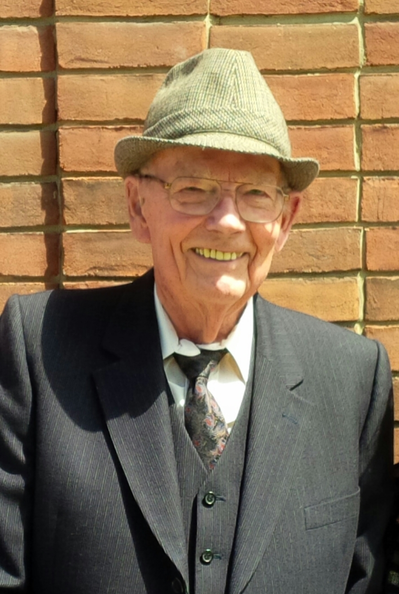

## Who was David Hadden?

David Hadden (1929-2017) was a devoted Canadian Bahá’í and long-time friend of Bill and Marguerite Sears who stepped forward with experience, construction expertise and funds to help lay the foundation for DRBI.  He had already designed and built previous Bahá’í structures, including the Yukon Bahá’í Institute, and was instrumental in restoring the dome of the House of Worship in Wilmette Illinois.

A civil engineer, David ran a reinforcing steel business in Toronto, Canada, while serving the Faith in a variety of capacities, including as Treasurer on the Canadian National Spiritual Assembly and as a member of the DRBI Board of Directors until 2005.

He derived the greatest pleasure from enabling others to reach their goals and served as pilot and companion for Hands of the Cause William Sears, John Robarts and Rúhíyyih Khánum (nee Mary Maxwell) as they made cross-country trips to visit both urban and isolated Bahá’í communities in Canada, the United States and abroad.

