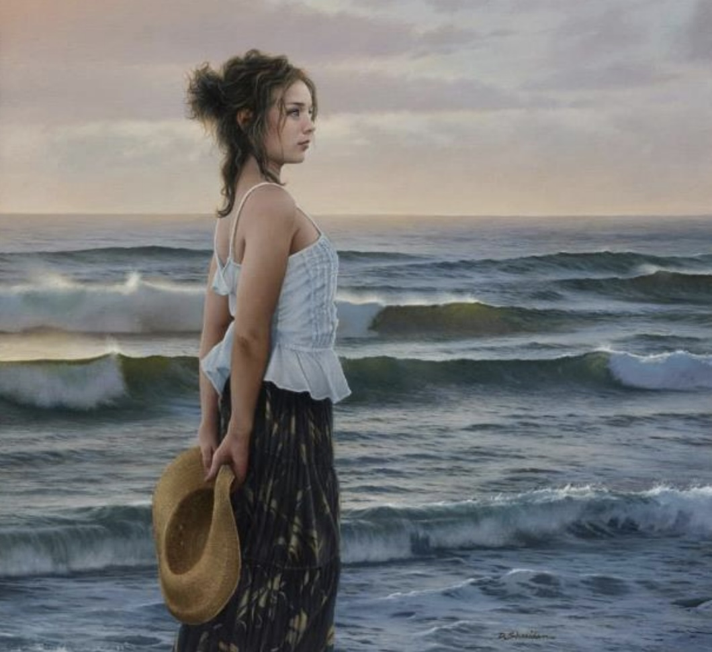

Duffy and Jeanne are two of the original DRBI community members and, with the exception of a few years’ absence, have lived near the Institute since its inception.

Duffy is a world-renowned realist painter who has accumulated a number of awards and accolades over his career, including the recent honour of receiving First Place – Best in Show from the International Guild Of Realism for his painting “Something I Don’t Know”.

Jeanne has joined Duffy as an artist in her own right after years in the corporate arena and is instrumental in the programming of events and activities around the Institute.  Jeanne also served as a member of the DRBI Board of Directors.

