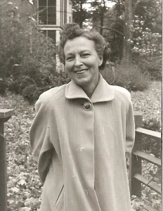
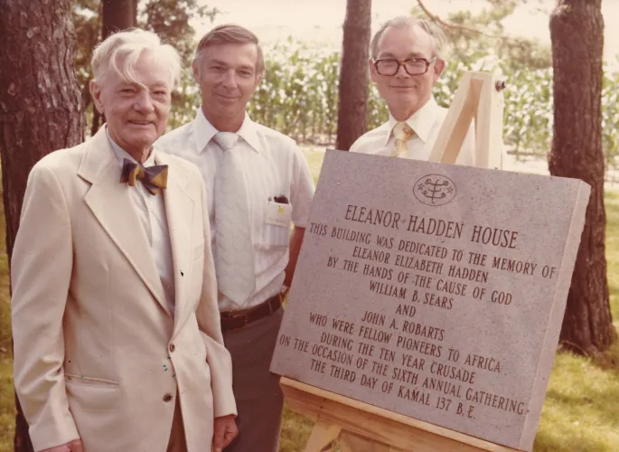

## Who was Eleanor Hadden?

Eleanor Elizabeth Hadden,  David Hadden’s mother, was a beloved Bahá’í who selflessly served the faith with her husband Lyall in Ghana, Zimbabwe (then Rhodesia) and the United States.  Eleanor Hadden’s dedication to the Faith was an inspiration to many.  She was particularly known for her way to keep isolated believers connected through her story-telling and written bulletins. In their early years, the Sears and the Haddens lived near to each other outside Philadelphia, Pennsylvania, and this led to a lifetime bond between the families.

For eleven years Marguerite and Bill Sears lived next door to David and Nancy Hadden in Port Hope, Ontario, Canada. For six of those years Bill hosted the Bahá’í ‘Gatherings’, summer weekend of spiritual deepening that drew friends from around the world.  To accommodate the 150+ people who came each year, David decided to build a dormitory in his mother’s name. A beautifully carved granite stone was fashioned to mark the place where the Eleanor Elizabeth Hadden House would stand and the stone was dedicated by Hands of the Cause William Sears and John Robarts.

Unfortunately, there was local opposition to changes in zoning and many months, tears and prayers later the project was abandoned.  According to DRBI Board Meeting minutes:  “The dining hall has been officially named by resolution, the ‘Eleanor Elizabeth Hadden Dining Hall’.  Had it not been for David Hadden, this building would have been built for much more than was projected.  What better way to say thank you than to honor his mother.”

