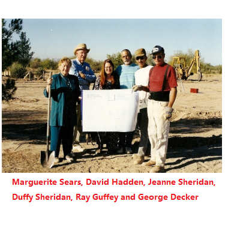
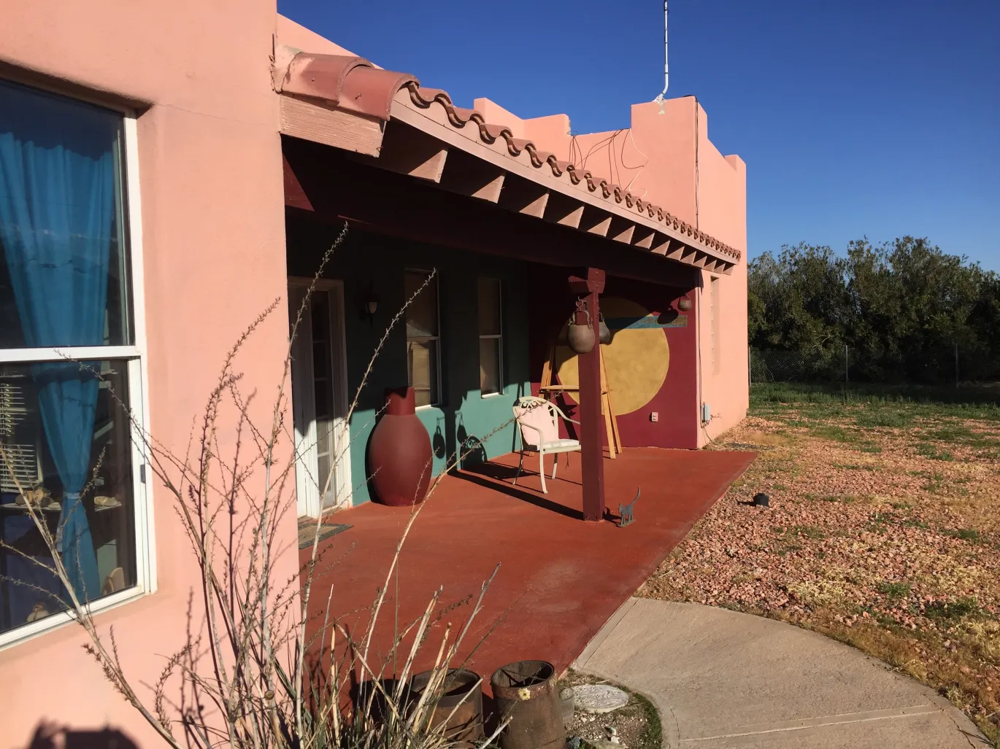

## DRBI History

###  1988 - Desert Rose Bahá’í School:

Hand of the Cause of God William Sears and his wife Marguerite Reimer Sears initiated the first Desert Rose Bahá’í School with the assistance of a core group of dedicated friends. This became an annual event for the Southern Arizona Bahá’í’s each Thanksgiving weekend and was held in a rented hall in Tucson, Arizona.

[Click here to read more about William Sears ->](/history/william-sears)

[Click here to read more about Marguerite Sears ->](/history/marguerite-sears)

****

### 1992 - William Sears passes away

Mr. Sears is interred at East Lawn Palms Cemetery in Tucson, Arizona. Marguerite was encouraged by the Universal House of Justice to expand the four-day Desert Rose Bahá’í school to a permanent institute.

****

### 1996 – Land was purchased

Marguerite Sears, with the help of many friends, purchased land near Eloy, Arizona for the development of the Desert Rose Bahá’í Institute, which she envisioned as an Institute for education in the arts and agriculture. When the land was purchased, the Round House was the only building on the property.

****

### 1996 – Sears Cottage, Ala’i Library & Office

A cottage was constructed for Mrs. Sears that provided both comfortable living space and room where she could work with partners on cataloguing and publishing some of Bill Sears’ remaining works while building a library.

****

### 1997 – Dedication

DRBI was dedicated on November 29, in honor of the two Hands of the Cause of God, General Shuá’u’lláh `Alá’í and, William Sears whose resting places are within an hour’s drive of the property. Two roads within the Institute are named in their honor.

[Click here to read about Shua’u’llah Ala’i ->](/history/shuallah-alai)

****

### 1997 – Incorporation

Desert Rose Bahá’í Institute incorporates with 501(c)3 Not-For-Profit status.

****

### 1999 – Meeting and Dining Hall Built

David Hadden designed and acted as general contractor for the first new structure at Desert Rose. As a surprise to David it was named Eleanor Hadden Hall in honor of his late mother.

[Eleanor Hadden and the naming of the dining hall](/history/eleanor-hadden)

****

### 1999– Guest House is Built

There was a need for additional housing at Desert Rose for guests. David Hadden built a guest house at his expense near the Sears’ cottage for he and his family to use in the winter. The house was given to the Institute for use by visiting dignitaries and kept free for the Haddens whenever they were at Desert Rose.

[David Hadden ->](/history/david-hadden)

****

### 2001 – Casa de Rosas are Built

As with any not-for-profit organization, DRBI requires reliable sources of income to offset operational costs. An inventive response to this need was the design and construction of the Casas de Rosas. The 16 rental apartments built around a restful courtyard allow for the perfect combination of privacy and community living while providing regular revenue to DRBI.

****

### 2004 - William Sears Pavilion

It was a vision of the Board of Directors to embody the spiritual peace of the desert in a structure where people could go to reflect, pray, meditate, or celebrate. The Pavilion was dedicated on November 27, 2000. The picture above shows David Hadden and Marguerite Sears preparing to place a box containing the names of all the friends of DRBI who donated towards the Pavilion’s construction.

****

### 2005 – DRBI Welcomes the Guffey Center

As weekend camps and retreats became more common it became apparent that DRBI needed more accommodations. The Guffey Center enables up to 50 people to stay during sessions. The Center honors two of DRBI’s steadfast volunteers, Ray and Gloria Guffey. Ray’s impact can be seen in every sidewalk and stone while Gloria continues to serve the Institute in any way she can.

****

### 2006 – Marguerite Sears passes

After many years of devoted service Mrs. Sears passes on at the age of 94. She is buried in the Memorial Garden at DRBI.

****

### 2017 - KURE LP FM

Volunteer Virginia Healey, then part of the DRBI Management learned that the FCC was opening a new license for a low power (LP) radio station for Eloy Arizona. Recognizing the opportunity to serve the community Virginia leapt at the chance. We are thrilled to have KURE LP 106.1 FM as a part of the Institute.

****

### 2018 - Guest House becomes the Art Gallery

Early residents and resident artists Duffy and Jeanne Sheridan proposed moving DRBI one step closer to the founders’ original vision by turning the Guest House into an Art Gallery. Using their own funds they converted what had been a two-bedroom home into an art space with room for shows, classes, and both painting and working pottery studios.

[Duffy and Jeanne Sheridan ->](/history/duffy-jeanne-sheridan)

*****

### 2019 - Art Gallery opening

Since January 2019, the renovated Art Center has hosted close to one thousand people. In four months alone, one hundred and twenty-two students took 24 classes in everything from painting, pastels, tile glazing and beading techniques to Musubi Stones, Pysanky Egg decorating and Silk Scarf dying. These classes were organized by local artist Bonnie Light, who volunteered her services to DRBI.

****

### 2019 - DRBI Farm

The Agriculture project, led by Board Member Dwight Cox, launched with the vision of converting untillable land to soil-rich land that can produce and support healthy organic food.

****

## A Legacy of Collaboration....

DRBI is deeply indebted to a number of people who aided in the initial funding, design, planning and construction of the Institute, including David and Nancy Hadden, Ray and Gloria Guffey, George Decker, Guy and Grant Hadden, Dan Popov, the Heydarian family, the Taleberza family, the Rowhani extended family (Navid and David), and innumerable other persons who pitched in to help in any way their talents allowed.

