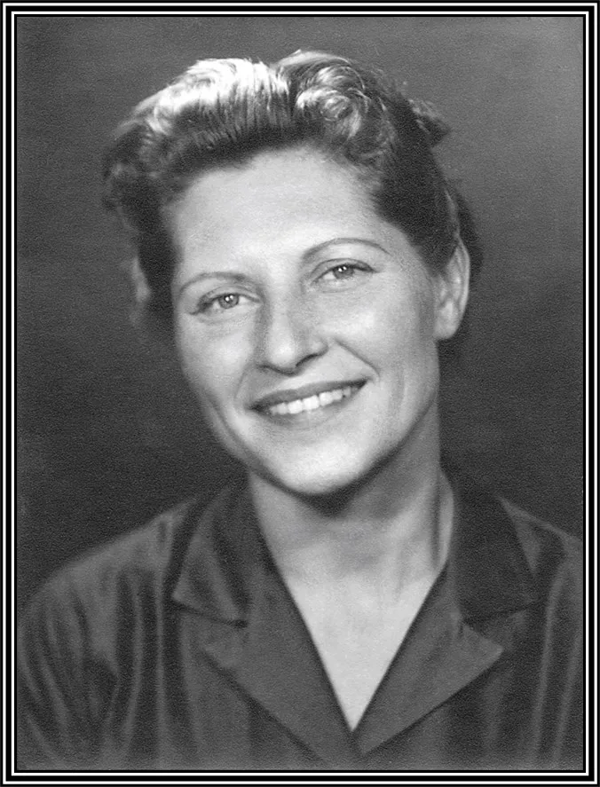

## Who was Marguerite Sears

Marguerite Reimer Sears was born in November 23, 1912. Her mother Viola Reimer was of French ancestry and her father, Charles Reimer, was a well-known businessman in the meat packing and sausage business. Unlike many families, her parents were successful and did not suffer financially during the depression. Marguerite attended mostly private Catholic schools and her love for Jesus was quite deep.  Marguerite’s education includes attendance at Stout College in Wisconsin, Marquette University, Duke University and Curry School of Speech in Boston. She also enjoyed watercolor art.

Her father, Charles Reimer, studied various philosophies and found the Bahá’í Faith. As Marguerite put it, this was one that he stuck with. After spending the summer with May Maxwell, who later married Shoghi Effendi, Great Grandson of Bahá’u’lláh, founder of the Bahá’í Faith, Marguerite embraced the Faith in 1934 at the age of 21.

Marguerite met Bill Sears in the little town of Manitowoc, Wisconsin, where she was giving a lecture series concerning her new beloved religion. Bill was working at the station and met her one afternoon when she had just finished a lecture. He converted her to the idea that marriage was a fine thing…she converted him to the Bahá’í Faith.

Marguerite also worked as a radio engineer, controlling the sound effects for Bill’s shows including such titles as “The Telegram’s Dick Tracy” readings. She learned radio engineering when she worked for the war information office in San Francisco.

After moving to various states in the United States for the Faith they decided in 1954 to sacrifice their careers in radio and television and set off to Africa with their 2 sons, Michael and Bill Jr.

When her husband Bill was appointed as a Hand of the Cause for the Bahá’í Faith, they sold their home in Africa so that they could travel anywhere the Faith needed them to go. She continued to support Bill with all his travels and duties as a Hand of the Cause. These travels, often paid out of their own pockets, took them around the work multiple times visiting at least 60 different countries.

As they got older and traveling became more difficult, and with the help of David Hadden, they settled first in Ontario Canada and then in Arizona. In 1988 Bill began yearly sessions in a Tucson hotel over Thanksgiving weekend. These sessions were called the Desert Rose Bahá’í School.

After the passing of her beloved husband in 1992, Marguerite continued with the concept of Desert Rose which resulted in her founding the Desert Rose Bahá’í Institute in 1996.

A lifelong supporter of the arts, she envisioned Desert Rose blossoming into a center for artistic expression and eventually becoming a university.

(excerpts of the above history were taken from the Salt Lake Telegram, Feb 14, 1946)

