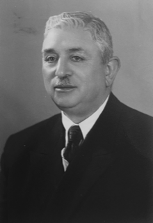

## Who was Shu’a’u’llah ‘A’la’i

(1889-1984) Shu’a’u’llah (which means ‘Light of God’) ‘A’la’i  was an Iranian Hand of the Cause. Born in Tehran into a prominent family: his father was set to become a cleric, but had converted to the Bahá’í Faith, and instead became physician to the royal household. Shu’a’u’llah ‘A’la’i studied accountancy, after which he pursued a distinguished career in various fields of government service, becoming chief controller of army finances (with the rank of general) at a young age. He was elected to the Tehran Bahá’í Local Spiritual Assembly in 1913, and to the very first Iranian Bahá’í National Spiritual Assembly in 1934, often serving as its chairman. Shoghi Effendi appointed him as a Hand of the Cause in 1952, and thereafter he travelled extensively, visiting Bahá’í communities in many parts of the world. He left Iran in 1978, spending the last few years of his life in France and then Arizona, where he is buried.

This succinct summation of Shu’a’u’llah ‘A’la’i’s life can’t begin to tell you why he was seen to be such an extraordinary man by so many, or why he was selected by Shoghi Effendi to become a Hand of the Cause.  Fortunately, DRBI Board of Directors Chairman Taj Sabet is General A’la’i’s descendant and so we asked him to tell us a few stories about his great-grandfather.  Here is what he said:

“The words I use to describe Hand of the Cause, General Alai, are loving, unshakable devotion, unwavering certitude, intense love for the cause of Bahá’u’lláh, honesty, integrity, trustworthiness, steadfastness, and devotion to family.

As a young adult around the age of 21, Shu’a’u’llah ‘A’la’i studied modern accounting principles.  He was soon assigned to work for the chief accountant of the government of Iran. Periodically the government would send people out to the provinces to conduct audits and there was one province that no accountant wanted to visit.  The person in charge was explosive, throwing out anyone who tried to question him.   ‘A’la’i offered to perform the audit if no one else would. When he arrived, he walked straight to the man in question, whose name was Reza Pahlavi, and without a word pulled up a chair, sat down next to him and opened the books. He redlined all the mistakes, closed the books, and left without saying a word.

Reza Pahlavi was speechless. Months later, he became the Shah of Iran, and began looking for Shu’a’u’llah ‘A’la’i’. The Shah had been so impressed with what ‘A’la’i had done, not only with the province’s books, but in his courage and his professionalism, he offered him the job of chief accountant.  Essentially ‘A’la’i was handed the keys to the vast treasures of the country.  After a few short years, state policy was altered by the Shah to require only one signature on all accounts – Alai’s.

To be openly Baha’i in the country of Iran is a difficult choice that often ends tragically, even now.

But Shu’a’u’llah ‘A’la’i never wavered.  In his meetings with high officials and government authorities he did not hesitate to state, fearlessly and without ambiguity the importance of the Cause of God.

When his brother died tragically, leaving five children ages 6 weeks to 10 years old, Shu’a’u’llah ‘A’la’i took on the added responsibility of raising the children as if they were his own.  He brought them into his home, shared meals and stories with them, ensuring they would never forget their father. Shortly after the death of his brother, A’la’i’s own father passed suddenly of a heart attack, leaving his 2 young siblings without their father. A’la’i again stepped up as the father figure and moved his siblings and his stepmother in with his family, where he could ensure they would feel safe and loved.

Shu’a’u’llah ‘A’la’i carried a challenging travel schedule and was deeply devoted to his duties as a Hand. That said, his relationships with his family, children and grandchildren were never neglected.  If separated from his beloved wife he wrote her long, detailed letters.  Family dinners were a respected routine. His grandchildren looked forward to the times they could spend with him as he told stories, played games, and read books with them. Stories that even today, are shared with family and friends. As his grandchildren grew and moved on with their lives, he would write letters with words of wisdom on how to navigate the world.

Because of the revolution in Iran Shu’a’u’llah ‘A’la’i was forced to leave his homeland, eventually settling in Arizona in the last few years of his life.  Even though did not know the language, friends and even strangers were attracted to him by the intense love for humanity that shone from his face.

