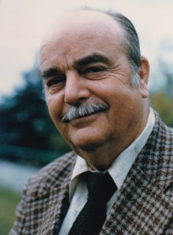

## Who was William Sears?

William Bernard Patrick Michael Terrance Sears VII, was born on March 28, 1911, in Duluth Minnesota, in Pumpkin Row. His family originally came from Court MacSherry Bay, Ireland. In one of his books he referred to himself as the Seventh Son of a Gun of a Seventh Son of a Gun. At a young age, he dreamt 3 times of a “Shiny white Figure”. He later discovered that the man in his dreams was ‘Abdu’l- Baha’ the son of Baha’u’llah, founder of the Baha’i Faith.

William, or Bill as he was often called, attended the University of Wisconsin where he studied writing and drama. He wrote plays and won awards in playwriting competitions. He married a beautiful young lady named Kathleen and they had 2 sons, William Jr. and Michael. After Michael’s birth, both Kathleen and Michael became ill and were hospitalized. Bill was 25, living during the depression with no work and little food, his wife Kathleen passed away, he had 2 sons, one in the hospital, the other staying with his sister. This made him wonder “is there a God and do we have souls?” He knew life had to be more than just getting up, going to work, going to bed, and dying.

Bill met Marguerite Reimer when he was working at WOMT radio station in Manitowoc, Wisconsin where she just happened to be giving a lecture series on the Baha’i Faith. He converted her to the idea that marriage was a fine thing…she converted him to the Baha’i Faith.

Marguerite was often wanting to move to help spread the Faith and luckily Bill was happy hopping from place to place. He began his career in Television when WCAU radio became WCAU Television. He later worked for CBS with his own shows such as “The Bill Sears” show and “In the Park”. In 1951, Bill was on the Edward R. Murrow program “This I Believe”. On the program Bill stated that “I found that happiness is not a matter of geography, but it is found within myself…I need only to remember one thing: nothing must come between me and my responsibilities to God and to my fellow man…This, I believe, has helped me to look upon each dawn as a new adventure.”

In 1954 Bill and Marguerite decided to set off to Africa with their 2 sons even though Bill’s career in Television was taking off. Bill continued his radio career with radio SABC, in South Africa.

In 1957, Bill Sears was elevated to a Hand of the Cause of God for the Baha’i Faith by Shoghi Effendi. They sold their home in Africa so that they could travel anywhere the Faith needed them to go.

His son Bill Sears Jr wrote: “I believe that anyone close to William Sears, both before after October and November of 1957, had to notice an abrupt change in him. Given the magnitude of the events that had taken place in that brief period of time, change was to be expected. Yet this was really notable, as it was a great change and in so short a time. It was like watching a caterpillar turn directly into a butterfly because there is no time for the cocoon.

His warm and loving nature, his sense of humor, and that sparkle in his eyes were intact, but there was a new intensity, a singleness of purpose, and you felt that no matter what else it might APPEAR that he was doing, he was really concentrating on what he could do, himself and through the friends, to advance the Faith, and fulfill the responsibilities entrusted to him by Shoghi Effendi.”

Bill and Marguerite traveled around the world multiple times visiting at least 60 different countries. During his talks he made us laugh and cry, inspiring us to new heights of service to God and mankind.

Bill and Marguerite also wrote many books. God Loves Laughter and All Flags Flying conveyed moral and life guidance through personal stories.  Others were written about the Heroes and Heroines of the Baha’i Faith.

With the help of David Hadden, they settled first in Ontario, Canada and then in Arizona and in 1988 Bill and Marguerite started Desert Rose Baha’i School.  The school was held every year at Tucson hotels over Thanksgiving weekend. Their vision continues today with DRBI in Eloy.

Bill Sears passed away in 1992, continuing to serve the Baha’i Faith to his last breath.

